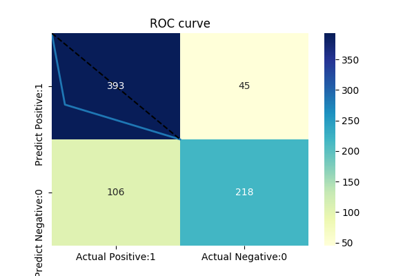
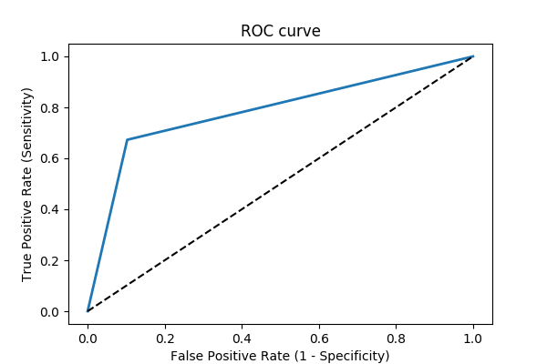

## Model report and score
### Single Score statistics
f1 score: 0.74

AUC (area under ROC curve) score: 0.79

### Confusion Matrix

              precision    recall  f1-score   support

           0       0.79      0.90      0.84       438
           1       0.83      0.67      0.74       324

    accuracy                           0.80       762
   macro avg       0.81      0.79      0.79       762
weighted avg       0.81      0.80      0.80       762
### ROC Curve
 

The dashed line represents random classification.
