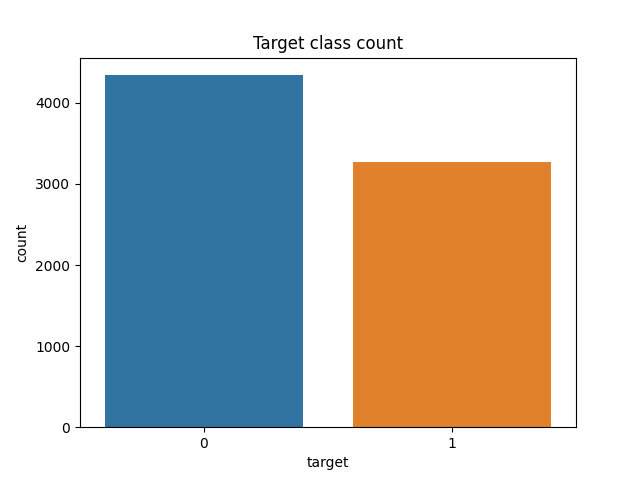
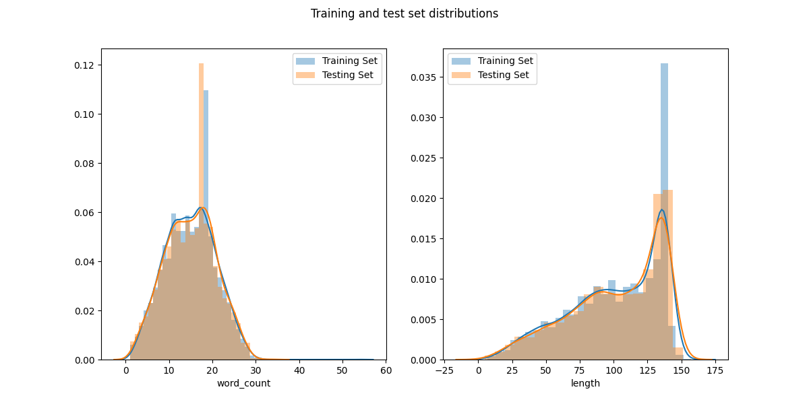
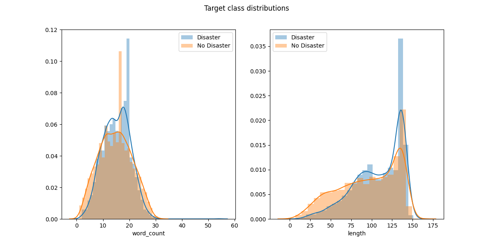

# Kaggle Disaster tweet competition
[https://www.kaggle.com/c/nlp-getting-started]
## About
This objective of this competition is to use NLP methods to determine if a tweet
is about a natural disaster or not (a two class classification problem). A large
training data set of ~ 7000 tweets is supplied and a testing set for submission.
### Model approaches

#### Word vectorizing
Each sentence is converted into a vector depending on the spaCy language model used. Semantic content is considered in this case.

## Data Exploration
As this is a classification problem the ratio of the target variables is important. If there is a large class imbalance, then when we split the data for training and validating we need to ensure we have a representative amount of each target.

This is not a problem with our dataset as there are roughly the same number of 'Disaster' tweets (`target = 1`) and 'No Disaster' (`target = 0`).

Figure 1: Count plot of the target varaibles. '1' corresponds to a disaster related tweet and '0' otherwise.

We also look at the word count distribution of the tweets to see if there are any outliers or abnormalities. As a defining characteristic of tweets is their limits length, there should not be any large outliers. Below are the total length (character count) and word count distributions of the training and test sets

From these distributions we see that the the training and test sets have near identical distributions of length. This is excellent as it makes it more likely the training set is a good representation of the test set.

Now we will see if there is a difference in distributions between the target classes. This is shown in the following plot:

We can see that, surprisingly, the distribution of word counts and total lengths are similar for each class. Therefore a crude classification scheme based on length and word count will be ineffective.

## Models
As this project is primarily for learning I will present several different approaches to traning and predicting the nature of tweets with different techniques. The first approach is the 'bag of words' approach.

### Bag of Words
NLP frequency based approach where each sentence is broken down into an unordered vector depending on how many times a specific word appears. This method does not preserve the order of the sentence or consider the semantic structure of the sentence.

In bag of words each separate 'document' (in this case tweet) is tokenized by seperating the sentence into individual components such as words and punctuation. These tokenized documents can then be normalized by removing stopwords, stemming etc.

After normalizing the data a count matrix is generated for each document. Each row of this matrix corresponds to each document in the corpus and the number of columns corresponds to the number of unique words in the entire corpus (order of tens of thousands). In the basic bag of words model the matrix is populated with integers based on how many times each word occurs in each document. This results in an incredibly sparse matrix in our case with tweets.

Below I use two separate BoW approaches. The scripts can be found in 'bow.py'

#### Sklearn approach

## Folders
### Scripts
Contains all the scripts for exploring the data, generating the models and classifying
the model.
#### exploration.py
Functions to explore the training and test data to make decisions on which model to implement.
#### model_evaluation.py
Functions to evaluate the results of the trained model on the validation set. Explores both single statistic summaries such as f1 measure (used by Kaggle for scoring) and AUR. Also contains functions to plot the confusion matrix and rOC curves.
#### bow.py
Basic 'Bag of words' classifier using spaCy package. Based on Kaggle tutorial.
#### tutorial.py
Tutorial code used to generate the sample_submission.csv file. Uses a vectorized words model and then a svm model to classify the tweets.
### Data
Contains the raw training and test data sets:
*train.csv
*test.csv
### Output
Output of the submission and models

### Notes on the Data
* From the data exploration the percentage of positive to  negative tweets is ~42% and therefore class imbalance should not be a large problem.

### Notes on Scripts
#### exploration.py
General data exploration script for the training and test data
